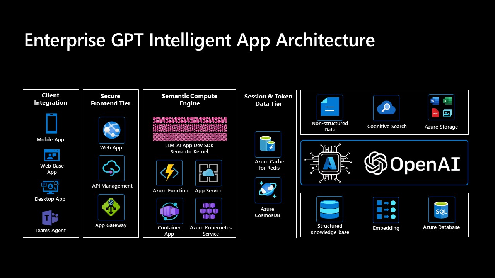

# Azure OpenAI App Innovation Workshop 

## Next-Gen GPT-ize Intelligent Application Architecture - A prompt engineering and RAG approach with LLM AI Dev Framework
The importance of Prompt Engineering in the field of large-scale language model applications is gradually becoming apparent. Prompt Engineering is a technique based on human language intuition that can help startup, corporate, and enterprises quickly achieve specific functions when building large language models. Based on the formal representation of natural language questions, Prompt Engineering can effectively guide the learning process of large language models, thereby improving their performance. Some papers have shown that in certain complex reasoning and thought-chain contexts, prompts even perform better than fine-tuning.

Retrieval Augmented Generation (RAG) is a method that greatly enhances the accuracy of GPT in answering questions. It combines pre-trained models with vectorized data storage, allowing for direct retrieval and manipulation of external knowledge during text generation. RAG can assist GPT models in better understanding and utilizing given knowledge, thus improving their performance in knowledge-intensive tasks. In practical applications, the RAG method can significantly improve the precision of model output and effectively prevent model hallucination and fabrication.

Based on these research findings, we have proposed a framework for enterprise-level next generation GPT intelligent application engineering, which is based on Retrieval Augmented Generation and Prompt Engineering methodology. The framework, as shown in the diagram below, allows developers to quickly build their own large-scale intelligent applications without modifying the model itself, and immediately enjoy the productivity dividend brought by the new generation of artificial intelligence for any business scenarios.

 

As shown in the diagram, this architecture utilizes a flexible semantic compute engine as prompt engine and supports various deployment forms such as PaaS, Serverless, and containers, enabling develoeprs to optimize the prompt engine with modern LLM AI application development framework and elastically scale computing resources according to real-time business needs. The session and token data service layer, based on Redis and CosmosDB, adds contextual caching, session persistence, prompt persistence, and other capabilities to the application, leaving room for future model or engine optimization based on prompts. The API encapsulation, load balancing, and gateway at the front end further enhance application security and reliability, allowing the intelligent entity to integrate with various front-end apps in a more secure and stable manner. Most importantly, this architecture is designed with a dual-engine architecture based on Azure Cognitive Search and vector embedding, two additional private knowledge base technologies. On the one hand, Azure Cognitive Search can quickly index unstructured data such as PDF and WORD files, allowing existing data to be used immediately. On the other hand, by utilizing Azure Database with vector storage and processing capabilities and combining them with Azure OpenAI's embedding vector generation model, the enterprise's existing structured knowledge base can be integrated easily, which producing more accurate, stable, and reliable results from the cutting-edge GPT model.

## Semantic Kernel - LLM AI Dev Framework / SDK

Semantic Kernel (SK) is a lightweight SDK enabling integration of AI Large Language Models (LLMs) with conventional programming languages. The SK extensible programming model combines natural language semantic functions, traditional code native functions, and embeddings-based memory unlocking new potential and adding value to applications with AI.

SK supports prompt templating, function chaining, vectorized memory, and intelligent planning capabilities out of the box.

 

Semantic Kernel is designed to support and encapsulate several design patterns from the latest in AI research, such that developers can infuse their applications with complex skills like prompt chaining, recursive reasoning, summarization, zero/few-shot learning, contextual memory, long-term memory, embeddings, semantic indexing, planning, and accessing external knowledge stores as well as your own data.

For more information, please visit [Semantic Kernel Project](https://github.com/microsoft/semantic-kernel)

## Azure GPT App Innovation Workshop 

This is an app innovation workshop focused on exploring the use of Azure PaaS and OpenAI GPT model to build modern large language modelintelligent applications. Workshop aims to provide practical skills and experience in developing innovative intelligent applications on Azure for IT and architecture decision-makers, business decision-makers, and developers.

In this workshop, attendees will learn how to select Azure workloads to design a modern GPT intelligent application, understand Azure OpenAI services, explore the capabilities of large model prompt engineering, understand common parameters and options in the OpenAI API, and land an next generation GPT intelligent application architecture inside their organization through hands-on experimentation.

Whether you are a novice or an experienced professional, this workshop will meet the expectations and needs of participants. Attendees will be able to interact with experts, share experiences, and gain inspiration and insights from real project cases. Together, we will explore exciting GPT intelligent applications and usher in a new era of intelligent applications!

- Workshop content [Chinese](./Workshop%20Content%20CHS/)
- Workshop content [English](./Workshop%20Content%20EN/)
- [Demo notebook](./Demo%20Notebook/)
- [Workshop code base](https://github.com/Azure/intelligent-app-workshop)

### Hands-on Related Repositories
- [ChatGPT Embeddings QnA](https://github.com/ruoccofabrizio/azure-open-ai-embeddings-qna)
- [LLM App Pattern - Project Miyagi](https://github.com/Azure-Samples/miyagi)
- [Knowledge Mining with OpenAI Architecture](https://github.com/MSUSAzureAccelerators/Knowledge-Mining-with-OpenAI)
- [Azure OpenAI Samples](https://github.com/Azure/azure-openai-samples)
- [Experimental: Uncle John's Semantic Kernel Recipes](https://github.com/johnmaeda/SK-Recipes)
- [Learn Azure OpenAI Service with .NET](https://github.com/kinfey/dotNETOAIBooks)

### Product Documents
- [Azure Openai](https://learn.microsoft.com/zh-cn/azure/cognitive-services/openai/)
- [Azure Cognitive Search](https://learn.microsoft.com/zh-cn/azure/search/)
- [Azure App Service](https://learn.microsoft.com/zh-cn/azure/app-service/)
- [Azure API Management](https://learn.microsoft.com/zh-cn/azure/api-management/)
- [Azure Container App](https://learn.microsoft.com/zh-cn/azure/container-apps/)
- [Azure Kubernetes Service](https://learn.microsoft.com/zh-cn/azure/aks/)
- [Azure CosmosDB](https://learn.microsoft.com/zh-cn/azure/cosmos-db/)
- [Azure Cache for Redis](https://learn.microsoft.com/zh-cn/azure/azure-cache-for-redis/)
- [Azure Azure Database for PostgreSQL](https://learn.microsoft.com/zh-cn/azure/postgresql/)
- [Qdrant Vector Database on Azure Cloud](https://github.com/Azure-Samples/qdrant-azure)

### Reference
- [Retrieval-Augmented Generation for Knowledge-Intensive NLP Tasks](https://arxiv.org/abs/2005.11401)
- [Sparks of Artificial General Intelligence: Early experiments with GPT-4](https://arxiv.org/abs/2303.12712)
- [HuggingGPT: Solving AI Tasks with ChatGPT and its Friends in HuggingFace](https://arxiv.org/abs/2303.17580)
- [Automatic Generation of Grammar-Agnostic Visualizations and Infographics](https://microsoft.github.io/lida/)
- [Chain-of-Thought Prompting Elicits Reasoning in Large Language Models. arXiv, 2022](https://arxiv.org/abs/2201.11903)
- [Emergent Analogical Reasoning in Large Language Models. arXiv:2212.09196, 2022](https://arxiv.org/abs/2212.09196)
- [Generated Knowledge Prompting for Commonsense Reasoning. arXiv:2110.08387, 2022](https://arxiv.org/abs/2110.08387)
- [Multitask Prompted Training Enables Zero-Shot Task Generalization. arXiv:2110.08207, 2022](https://arxiv.org/abs/2110.08207)
- [Prompt Programming for Large Language Models: Beyond the Few-Shot Paradigm. arXiv:2102.07350, 2021](https://arxiv.org/abs/2102.07350)
- [Self-Consistency Improves Chain of Thought Reasoning in Language Models. arXiv:2203.11171, 2022](https://arxiv.org/abs/2203.11171)
- [How does GPT Obtain its Ability? Tracing Emergent Abilities of Language Models to their Sources](https://yaofu.notion.site/How-does-GPT-Obtain-its-Ability-Tracing-Emergent-Abilities-of-Language-Models-to-their-Sources-b9a57ac0fcf74f30a1ab9e3e36fa1dc1#a83aa8c34a254289ace924fa83e0b9c9)
- [A Closer Look at Large Language Models Emergent Abilities](https://yaofu.notion.site/A-Closer-Look-at-Large-Language-Models-Emergent-Abilities-493876b55df5479d80686f68a1abd72f)
- [Illustrating Reinforcement Learning from Human Feedback (RLHF)](https://huggingface.co/blog/rlhf)
- [Best practices for prompt engineering with openai api](https://help.openai.com/en/articles/6654000-best-practices-for-prompt-engineering-with-openai-api)
- [Awesome ChatGPT Prompts](https://github.com/f/awesome-chatgpt-prompts/)
- [Durable Task Framework](https://github.com/microsoft/durabletask-go/tree/dapr)
- [Hackathon Materials for Semantic Kernel](https://learn.microsoft.com/en-us/semantic-kernel/support/hackathon)